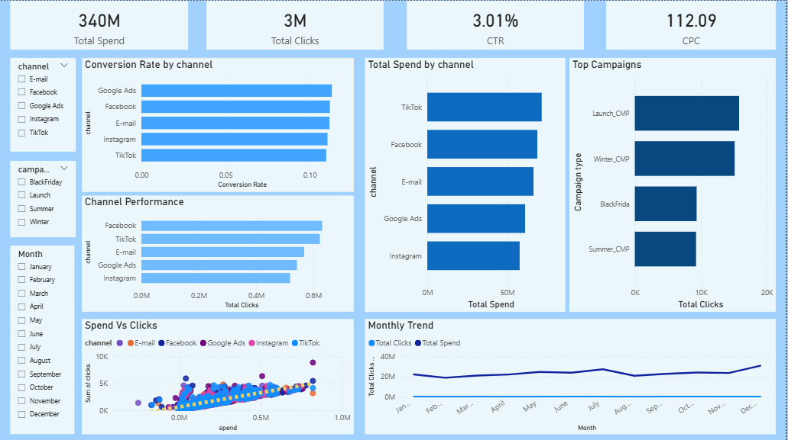

# Marketing Campaign Performance Analysis

## Project Overview

Marketing teams run multiple campaigns across different platforms such as Facebook, Google Ads, Instagram, and TikTok. However, raw marketing data is often messy and inconsistent, making it difficult to evaluate campaign performance and make data-driven decisions.

This project demonstrates how **raw marketing campaign data can be cleaned, analyzed, and transformed into actionable insights** using Python and Power BI.

The goal was to simulate a real-world analytics workflow:
1. Clean messy marketing data
2. Analyze campaign performance
3. Build a dashboard to support business decisions

---

# Business Problem

Marketing teams need answers to key questions:

- Which marketing channel performs best?
- Where should the marketing budget be allocated?
- Which campaigns generate the most engagement?
- Is higher marketing spend actually driving more clicks?

However, the dataset contained several data quality issues that prevented proper analysis.

---

# Data Cleaning (Python)

The raw dataset contained common real-world problems such as:

- Missing values
- Inconsistent text formatting
- Currency values mixed with text
- Incorrect date formats
- Logical inconsistencies in metrics
- Duplicate or redundant information
- Outliers in numerical columns

Using **Python and Pandas**, the dataset was cleaned and standardized.

### Cleaning Steps

- Standardized column names
- Handled missing values
- Converted spend values to numeric format
- Fixed inconsistent marketing channel names
- Converted date columns into proper datetime format
- Detected and corrected logical inconsistencies
- Removed or handled outliers
- Extracted features from campaign names

After cleaning, the dataset became structured and ready for analysis.

---

# Data Analysis & Dashboard (Power BI)

Once the dataset was prepared, an interactive dashboard was built using **Microsoft Power BI** to analyze marketing campaign performance.

## Dashboard Preview

---

# Key Metrics Used

The analysis focuses on important marketing performance indicators:

- Total Marketing Spend
- Total Clicks
- Click Through Rate (CTR)
- Cost Per Click (CPC)
- Conversion Rate

---

# Dashboard Analysis

The dashboard provides insights through multiple perspectives.

### Channel Performance
- Total Spend by Channel
- Total Clicks by Channel
- Conversion Rate by Channel

### Campaign Analysis
- Top performing campaigns by clicks
- Campaign performance comparison

### Marketing Efficiency
- Relationship between marketing spend and clicks

### Time Trend
- Monthly marketing performance trend

---

# Key Insights

The analysis revealed several important insights:

**1. TikTok received the highest marketing spend**
- Indicates heavy investment in this platform.

**2. Facebook generated the highest number of clicks**
- Suggests strong audience engagement.

**3. Google Ads showed the highest conversion rate**
- Potentially the most efficient channel for conversions.

**4. Launch campaigns drove the highest engagement**
- These campaigns outperformed others in click generation.

**5. Marketing spend and clicks show a positive relationship**
- Higher investment generally leads to increased engagement.

---

# Business Outcome

By transforming raw marketing data into an analytical dashboard, this project helps answer important business questions:

- Which marketing channels perform best?
- How effective are marketing campaigns?
- Where should marketing budgets be allocated?
- What trends exist across marketing performance over time?

This demonstrates how **data analysts move beyond data cleaning to generate insights that support business decisions.**

---

# Technologies Used

Python  
Pandas  
NumPy  
Google Colab  
Microsoft Power BI  

---

# Project Structure

marketing-campaign-analysis/
│
├── data_cleaning_notebook.ipynb
├── cleaned_marketing_dataset.csv
├── marketing_dashboard.pbix
├── dashboard.png
└── README.md

---

# Key Takeaway

Data analysts do not just clean data.

They transform raw data into insights that help businesses make better decisions.

---

# Author

Bhargav Jagtap

Aspiring Data Analyst focused on:
- Data Analytics
- Business Intelligence
- Data Visualization

Real Business Questions Answered

